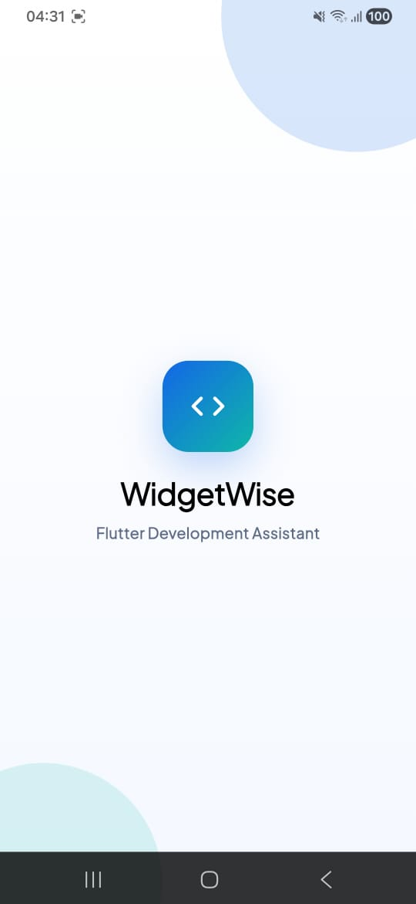
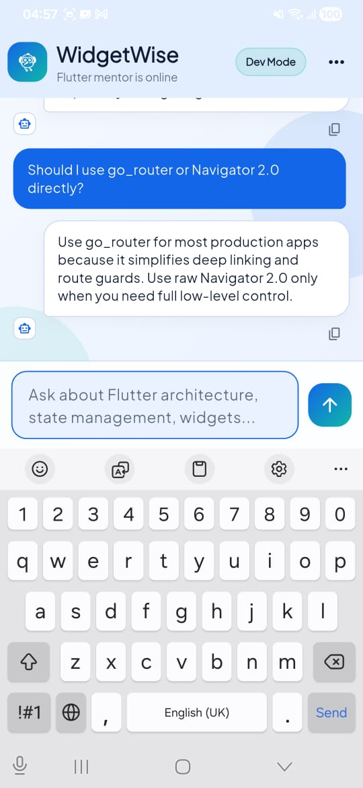
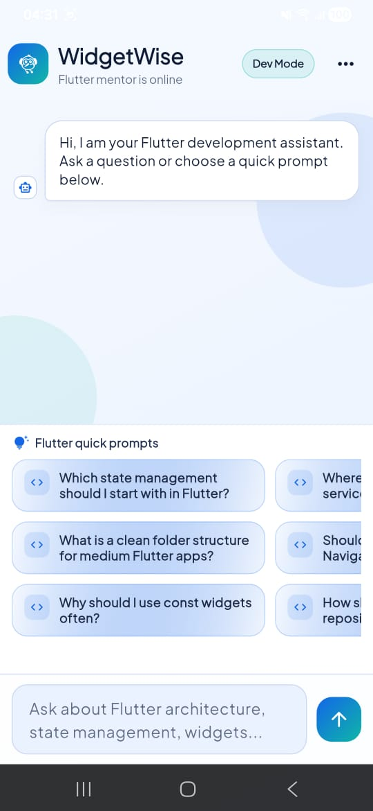

# WidgetWise

WidgetWise is a focused Flutter development assistant built with Flutter and BLoC.
It answers predefined Flutter FAQ prompts first, then falls back to AI for Flutter-related questions.
For non-Flutter questions, it responds with a friendly scope reminder.

## Features

- Clean chat-first UI with splash and assistant branding.
- Curated Flutter quick prompts.
- FAQ-first answer logic for fast local responses.
- AI fallback for Flutter/Dart/cross-platform related questions.
- Friendly fallback for out-of-scope (non-Flutter) questions.
- Environment-based configuration with `.env`.

## Demo Video

Add your demo video here (YouTube/Loom/GitHub asset link):

`<PASTE_VIDEO_URL_HERE>`

Example:

`https://youtu.be/your-demo-id`

## Screenshots

Place screenshots in a folder like `docs/screenshots/`, then reference them:

```md



```

Suggested captures:
- Splash screen
- Chat screen (empty state)
- Chat screen (with conversation)
- Suggestions section
- AI fallback response example

## Tech Stack

- Flutter (Material 3)
- `flutter_bloc` + `equatable` for state management
- `get_it` for dependency injection
- `dio` for network requests
- `flutter_dotenv` for runtime environment config
- `google_fonts` for typography

## Project Structure

```text
lib/
  app/                 # app shell + routes
  core/                # config, DI, networking, theme
  features/
    splash/            # splash screen
    chat/              # data, domain, presentation layers
```

## Setup

### 1. Prerequisites

- Flutter SDK installed
- Dart SDK (comes with Flutter)
- iOS/Android/Web target tooling as needed

### 2. Install dependencies

```bash
flutter pub get
```

### 3. Configure environment

Create a `.env` file in the project root:

```env
OPENAI_API_KEY=your_openai_api_key
OPENAI_MODEL=gpt-4.1-mini
```

Use `.env.example` as template when sharing the repo.

### 4. Run the app

```bash
flutter run
```

## Quality Checks

```bash
flutter analyze
flutter test
```

## Current Chat Logic

1. Try exact/keyword match in local Flutter FAQ list.
2. If no FAQ match:
   - If question looks Flutter-related -> ask AI.
   - Else -> return a friendly "Flutter-only scope" response.

## Security Notes

- Never commit `.env`.
- Rotate API keys if they were exposed.
- Keep model/API settings configurable via env variables.
# flutter-dev-assistant
